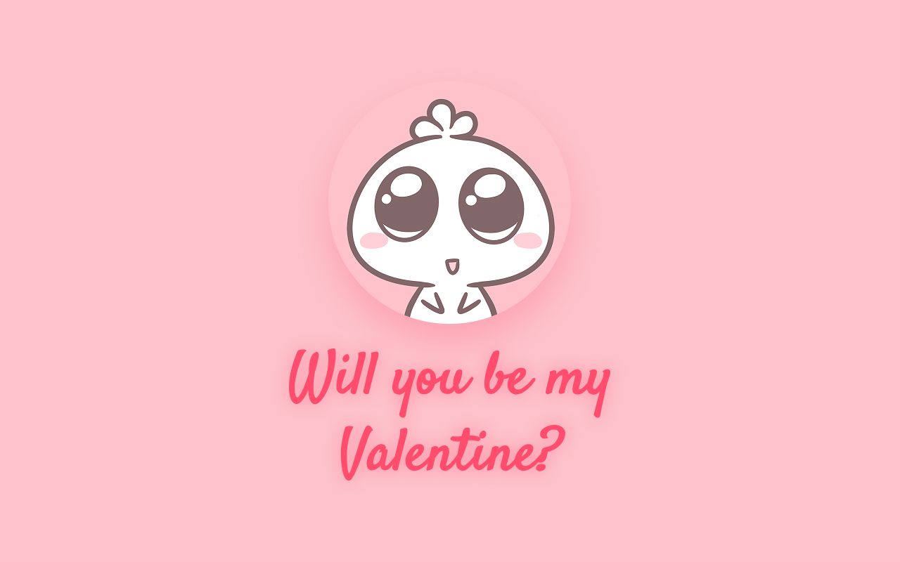

# Will You Be My Valentine? 💖

A playful and interactive web-based Valentine's proposal.

## Overview

This project is a fun, mobile-friendly website designed to ask that special someone "Will you be my Valentine?". It features a mischievous "No" button that evades clicks, a celebration page for "Yes", and a special hidden page for those who are persistent in saying no!

## Credits

-   **Original Code**: Inspired by [Samarth Mishra's](https://github.com/iamsamarthmishra/valentinecode_JFF) project.
-   **GIFs**: Cute animated illustrations provided by [Moobub](https://giphy.com/moobub).

## Features

-   **Interactive "No" Button**: The button playfully runs away when hovered over or clicked.
-   **Secret "No" Page**: If someone tries to click the "No" button 25 times, they are redirected to a special page asking them to "rethink" their life choices.
-   **Celebration Page**: A cute "Hurray!" page with a GIF and a link to connect further.
-   **Responsive Design**: looks great on both desktops and mobile devices with a custom pink theme.
-   **Custom Fonts**: Uses 'Satisfy' for elegant headers and 'Nunito' for clear, readable text.

## How to Run

Simply open `index.html` in any modern web browser.

## Project Structure

-   `index.html`: The main landing page with the question.
-   `yes.html`: The success page shown after clicking "Yes".
-   `no.html`: The fallback page shown if the user persists in clicking "No".
-   `styles.css`: Contains all the styling for the project.

## Technologies Used

-   HTML5
-   CSS3
-   JavaScript

Enjoy! 💌
